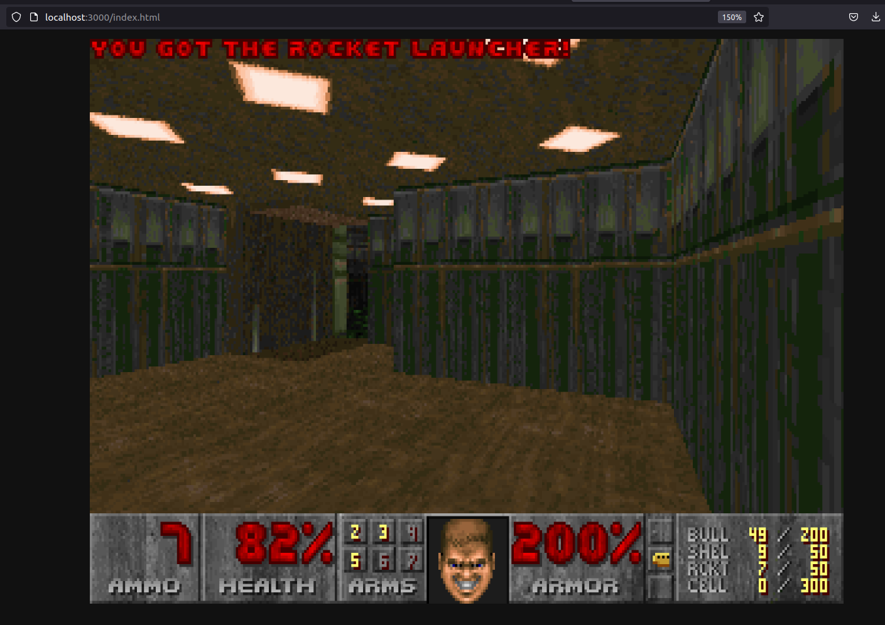

# spin-doom

A simple [spin][1] app for serving [doom-wasm][2]




## Requirements

* [spin][1]
* `automake`
* `curl`
* See [doom-wasm requirements](https://github.com/cloudflare/doom-wasm#requirements)

## Building

```
make init
make build
make doom-site
make download
```

## Running

```
spin up
```

[1]: https://github.com/fermyon/spin
[2]: https://github.com/cloudflare/doom-wasm

